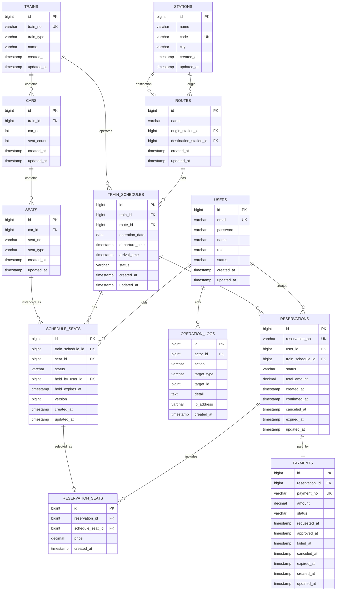

# ERD

이 문서는 RailOps의 초기 데이터베이스 구조와 관계, 제약 조건, 인덱스 초안을 정리합니다. 실제 JPA 엔티티와 마이그레이션을 작성하면서 세부 컬럼 타입은 조정할 수 있습니다.

## Mermaid ERD 초안

## 핵심 제약 조건

### users

- `email` unique
- `role`은 USER, ADMIN 중 하나
- `status`는 ACTIVE, LOCKED, DELETED 중 하나

### stations

- `code` unique
- 검색 성능을 위해 `name`, `city` 인덱스 검토

### routes

- `origin_station_id`와 `destination_station_id`는 같을 수 없음
- `name`, `origin_station_id`, `destination_station_id` 조합 unique 검토

### trains

- `train_no` unique

### cars

- `train_id`, `car_no` 조합 unique

### seats

- `car_id`, `seat_no` 조합 unique

### train_schedules

- `operation_date`, `route_id`, `departure_time` 인덱스
- 열차 검색 조건이 출발역/도착역/날짜이므로 Route와 함께 조회 최적화 필요

### schedule_seats

- `train_schedule_id`, `seat_id` 조합 unique
- `train_schedule_id`, `status` 인덱스
- `status`, `hold_expires_at` 인덱스
- HOLD 만료 배치 조회를 위해 `status = HELD and hold_expires_at < now()` 조건을 빠르게 찾을 수 있어야 함

### reservations

- `reservation_no` unique
- `user_id`, `created_at` 인덱스
- `status`, `created_at` 인덱스

### reservation_seats

- `reservation_id` 인덱스
- `schedule_seat_id` 인덱스
- CONFIRMED 예매와 연결된 좌석 중복 방지는 애플리케이션 락과 상태 전이로 우선 보장

### payments

- `payment_no` unique
- `reservation_id` unique
- `status`, `created_at` 인덱스

### operation_logs

- `actor_id`, `created_at` 인덱스
- `action`, `created_at` 인덱스
- `target_type`, `target_id` 인덱스

## 1차 보류 사항

- 가격 모델은 아직 확정하지 않습니다.
- 결제 완료 후 환불 전용 상태는 1차 구현에서 단순화합니다.
- 대기열, 다중 WAS, RDS, ElastiCache는 확장 단계에서 별도 설계합니다.
