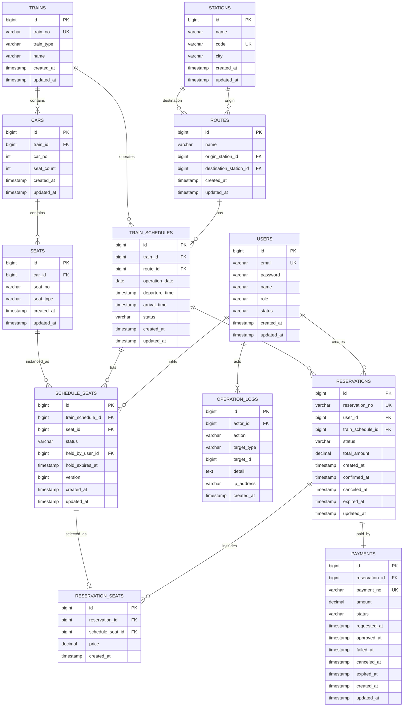

# ERD

이 문서는 RailOps의 데이터베이스 설계 초안입니다. ERD는 Entity Relationship Diagram의 약자로, 데이터베이스에 어떤 테이블이 있고 그 테이블들이 서로 어떻게 연결되는지를 보여주는 설계도입니다.

## ERD를 왜 먼저 작성하는가

RailOps의 핵심은 좌석 예매 정합성입니다. 사용자가 같은 좌석을 동시에 예매하려고 할 때 한 명만 성공해야 하므로, 데이터 구조를 먼저 정확히 잡아야 합니다.

ERD를 먼저 작성하면 다음을 미리 확인할 수 있습니다.

- 어떤 테이블이 필요한지
- 테이블 사이의 관계가 맞는지
- 중복 예매를 막기 위해 어떤 제약 조건이 필요한지
- 조회 성능을 위해 어떤 인덱스가 필요한지
- Spring JPA Entity를 만들 때 어떤 관계를 코드로 표현해야 하는지

즉, 이 문서는 바로 DB를 만드는 실행 파일은 아닙니다. 하지만 이 문서를 기준으로 실제 PostgreSQL DDL, JPA Entity, Repository, API를 만들게 됩니다.

## 용어 정리

```text
Entity       업무에서 관리해야 하는 대상. 예: User, Train, Reservation
Table        DB에 실제로 저장되는 표. 예: users, trains, reservations
Column       테이블의 속성. 예: email, status, created_at
PK           Primary Key. 각 행을 구분하는 고유 ID
FK           Foreign Key. 다른 테이블을 참조하는 값
UK           Unique Key. 중복을 허용하지 않는 값
Index        조회를 빠르게 하기 위한 DB 구조
Constraint   데이터가 잘못 들어가지 않게 막는 규칙
```

## 전체 관계 요약

```text
User
- 예매를 만든다.
- 좌석을 임시 점유할 수 있다.
- 운영 로그의 행위자가 될 수 있다.

Station
- Route의 출발역 또는 도착역이 된다.

Route
- 출발역과 도착역을 연결한다.
- TrainSchedule이 어떤 구간을 운행하는지 나타낸다.

Train
- 객차(Car)를 가진다.
- 특정 날짜의 운행편(TrainSchedule)으로 배정된다.

Car
- 좌석(Seat)을 가진다.

Seat
- 객차 안의 물리 좌석이다.
- 예매 상태는 직접 들고 있지 않는다.

TrainSchedule
- 특정 날짜와 시간에 운행하는 열차 편성이다.
- 실제 예매 대상이다.

ScheduleSeat
- 특정 운행편에서의 좌석 상태이다.
- 좌석 예매 정합성의 핵심 테이블이다.

Reservation
- 사용자의 예매 단위이다.

ReservationSeat
- 예매에 포함된 좌석 목록이다.

Payment
- Reservation에 연결된 가상 결제 정보이다.

OperationLog
- 운영자가 확인할 수 있는 주요 이벤트 로그이다.
```

## Mermaid ERD 초안



## 핵심 설계 포인트

### Seat와 ScheduleSeat를 분리한다

`Seat`는 물리 좌석입니다.

```text
3호차 12A
3호차 12B
```

하지만 같은 좌석이라도 운행일과 운행편이 다르면 예매 상태가 달라집니다.

```text
2026-08-01 KTX-101 3호차 12A = RESERVED
2026-08-02 KTX-101 3호차 12A = AVAILABLE
```

그래서 좌석 상태는 `Seat`가 아니라 `ScheduleSeat`가 관리합니다.

### HELD와 BLOCKED를 분리한다

`HELD`는 사용자가 결제하기 전 잠시 잡아둔 상태입니다.

```text
AVAILABLE -> HELD -> RESERVED
AVAILABLE -> HELD -> AVAILABLE
```

`BLOCKED`는 관리자가 판매를 막은 상태입니다.

```text
AVAILABLE -> BLOCKED -> AVAILABLE
```

BLOCKED는 결제 만료로 자동 해제되면 안 됩니다.

### HOLD 만료 기준은 DB에 둔다

HOLD 만료 기준은 `schedule_seats.hold_expires_at`입니다. Redis TTL은 나중에 보조 수단으로 사용할 수 있지만, 1차 정합성 기준은 PostgreSQL입니다.

Spring Scheduler는 다음 조건으로 만료 좌석을 찾습니다.

```sql
status = 'HELD'
and hold_expires_at < now()
```

## 주요 제약 조건

### users

- `email` unique
- `role`은 USER, ADMIN 중 하나
- `status`는 ACTIVE, LOCKED, DELETED 중 하나

### stations

- `code` unique
- `name`, `city` 검색 인덱스 검토

### routes

- `origin_station_id`와 `destination_station_id`는 같을 수 없음
- `name`, `origin_station_id`, `destination_station_id` 조합 unique 검토

### trains

- `train_no` unique

### cars

- `train_id`, `car_no` 조합 unique

### seats

- `car_id`, `seat_no` 조합 unique

### train_schedules

- `operation_date`, `route_id`, `departure_time` 인덱스
- 열차 검색 조건이 출발역, 도착역, 날짜이므로 Route와 함께 조회 최적화 필요

### schedule_seats

- `train_schedule_id`, `seat_id` 조합 unique
- `train_schedule_id`, `status` 인덱스
- `status`, `hold_expires_at` 인덱스
- HOLD 만료 배치 조회를 위해 `status = HELD and hold_expires_at < now()` 조건을 빠르게 찾아야 함

### reservations

- `reservation_no` unique
- `user_id`, `created_at` 인덱스
- `status`, `created_at` 인덱스

### reservation_seats

- `reservation_id` 인덱스
- `schedule_seat_id` 인덱스

### payments

- `payment_no` unique
- `reservation_id` unique
- `status`, `created_at` 인덱스

### operation_logs

- `actor_id`, `created_at` 인덱스
- `action`, `created_at` 인덱스
- `target_type`, `target_id` 인덱스

## 이 문서 다음 단계

이 ERD를 기준으로 다음 산출물을 만듭니다.

```text
1. docs/18-database-ddl.md
   실제 PostgreSQL CREATE TABLE 초안

2. Spring Boot Entity
   User, Station, Route, Train, ScheduleSeat 등 Java 클래스

3. Repository
   DB 조회와 락 조회 메서드

4. Service
   좌석 HOLD, 결제, 만료 처리 비즈니스 로직
```

## 1차 보류 사항

- 가격 모델은 아직 확정하지 않습니다.
- 결제 완료 후 환불 전용 상태는 1차 구현에서 단순화합니다.
- 대기열, 다중 WAS, RDS, ElastiCache는 확장 단계에서 별도 설계합니다.
