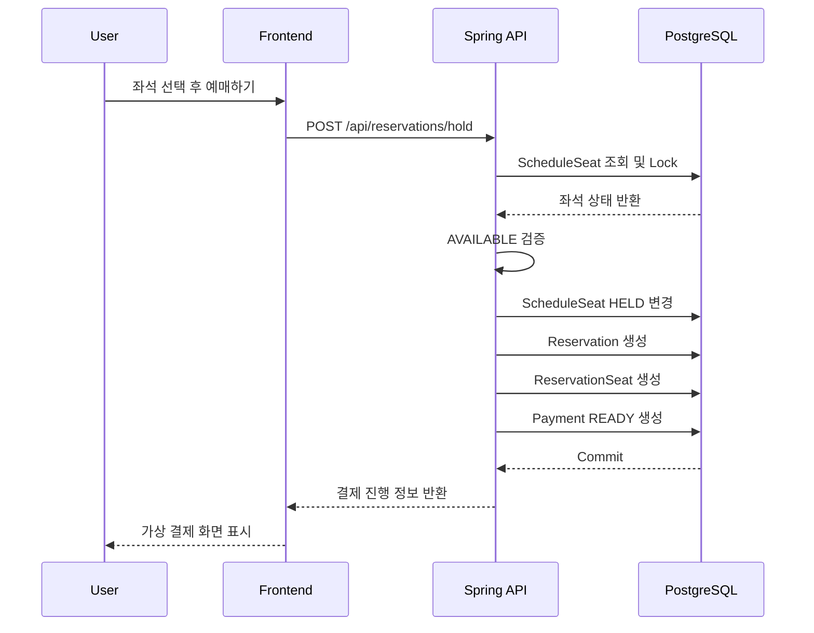

# 예매 흐름

RailOps의 예매 흐름은 좌석을 바로 RESERVED로 바꾸지 않고, 결제 전 HELD 상태로 임시 점유한 뒤 결제 결과에 따라 확정하거나 해제합니다.

## 좌석 상태 전이

```text
AVAILABLE → HELD → RESERVED
AVAILABLE → HELD → AVAILABLE
AVAILABLE → BLOCKED → AVAILABLE
```

금지되는 전이:

```text
BLOCKED → HELD
RESERVED → HELD
RESERVED → AVAILABLE   단, 예매 취소 정책에 따라 별도 처리
HELD → BLOCKED         일반 사용자 예매 흐름에서는 금지
```

## 좌석 HOLD 생성 흐름

```text
1. 사용자가 로그인한다.
2. 열차를 검색한다.
3. 운행편을 선택한다.
4. 객차와 좌석을 선택한다.
5. 예매하기 버튼을 누른다.
6. 백엔드는 선택 좌석을 ID 오름차순으로 조회한다.
7. 조회한 ScheduleSeat 행을 트랜잭션 안에서 잠근다.
8. 모든 좌석이 AVAILABLE인지 확인한다.
9. ScheduleSeat 상태를 HELD로 변경한다.
10. held_by_user_id를 현재 사용자 ID로 저장한다.
11. hold_expires_at을 현재 시각 + 10분으로 저장한다.
12. Reservation을 PENDING_PAYMENT로 생성한다.
13. ReservationSeat를 생성한다.
14. Payment를 READY로 생성한다.
15. 응답으로 reservationId, paymentId, holdExpiresAt을 반환한다.
```

## 시퀀스 다이어그램



## HOLD 만료 처리

1차 설계에서는 PostgreSQL의 `schedule_seats.hold_expires_at`을 기준으로 합니다.

Spring Scheduler는 일정 주기마다 다음 조건의 좌석을 조회합니다.

```text
status = HELD
hold_expires_at < now()
```

만료 대상이 있으면 다음 상태 변경을 같은 트랜잭션에서 처리합니다.

```text
ScheduleSeat: HELD → AVAILABLE
Reservation: PENDING_PAYMENT → EXPIRED
Payment: READY → EXPIRED
OperationLog: SEAT_HOLD_EXPIRED 저장
```

## 결제 API에서의 만료 재확인

Scheduler는 주기적으로 실행되므로 실제 만료 시각보다 몇 초 늦게 처리될 수 있습니다. 그래서 결제 성공 API에서도 반드시 만료 여부를 다시 확인합니다.

```text
결제 성공 요청
→ Payment READY 확인
→ Reservation PENDING_PAYMENT 확인
→ ScheduleSeat HELD 확인
→ hold_expires_at >= now() 확인
→ 통과하면 CONFIRMED/RESERVED
→ 이미 만료되었으면 EXPIRED/AVAILABLE
```

## 실패 케이스

### 좌석 일부가 이미 점유됨

선택한 좌석 중 하나라도 AVAILABLE이 아니면 전체 예매를 실패시킵니다. 부분 성공은 허용하지 않습니다.

### 여러 좌석 동시 선택

여러 좌석을 선택한 경우 좌석 ID 오름차순으로 잠급니다. 이는 데드락 가능성을 줄이기 위한 규칙입니다.

### 운행편 상태가 예매 불가

운행편이 CANCELED, COMPLETED 상태이면 좌석이 AVAILABLE이어도 예매할 수 없습니다.

## 운영 로그

예매 흐름에서는 다음 이벤트를 저장합니다.

```text
RESERVATION_CREATED
SEAT_HOLD_EXPIRED
RESERVATION_CANCELED
```
