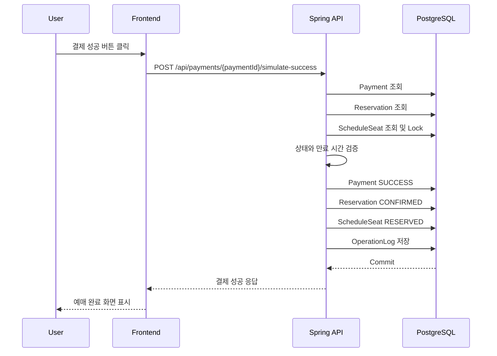

# 결제 흐름

RailOps의 결제는 실제 PG 연동이 아닌 가상 결제입니다. 그러나 결제 상태, 예매 상태, 좌석 상태 전이는 실제 서비스처럼 백엔드에서 일관되게 처리합니다.

## 상태 모델

Payment 상태:

```text
READY
SUCCESS
FAILED
CANCELED
EXPIRED
```

Reservation 상태:

```text
PENDING_PAYMENT
CONFIRMED
CANCELED
EXPIRED
PAYMENT_FAILED
```

ScheduleSeat 상태:

```text
AVAILABLE
HELD
RESERVED
BLOCKED
```

## 결제 성공

```text
Payment: READY → SUCCESS
Reservation: PENDING_PAYMENT → CONFIRMED
ScheduleSeat: HELD → RESERVED
```

처리 조건:

- Payment가 READY 상태여야 합니다.
- Reservation이 PENDING_PAYMENT 상태여야 합니다.
- 연결된 모든 ScheduleSeat가 HELD 상태여야 합니다.
- 모든 ScheduleSeat의 `held_by_user_id`가 결제 요청 사용자와 같아야 합니다.
- 모든 ScheduleSeat의 `hold_expires_at`이 현재 시각보다 미래여야 합니다.

## 결제 실패

```text
Payment: READY → FAILED
Reservation: PENDING_PAYMENT → PAYMENT_FAILED
ScheduleSeat: HELD → AVAILABLE
```

추가 처리:

```text
held_by_user_id = null
hold_expires_at = null
```

## 결제 취소

```text
Payment: READY → CANCELED
Reservation: PENDING_PAYMENT → CANCELED
ScheduleSeat: HELD → AVAILABLE
```

결제 화면에서 사용자가 취소 버튼을 누른 경우입니다.

## 결제 시간 초과

```text
Payment: READY → EXPIRED
Reservation: PENDING_PAYMENT → EXPIRED
ScheduleSeat: HELD → AVAILABLE
```

시간 초과는 Spring Scheduler 또는 결제 API의 만료 재확인 로직에서 처리합니다.

## 시퀀스 다이어그램



## 결제 완료 후 예매 취소

1차 구현에서는 결제 완료 후 환불 모델을 단순화합니다.

정책 초안:

```text
Reservation: CONFIRMED → CANCELED
ScheduleSeat: RESERVED → AVAILABLE
Payment: SUCCESS 유지
```

실제 환불 상태가 필요해지면 Payment 상태에 `REFUNDED`를 추가하는 방안을 검토합니다.

## 운영 로그

결제 흐름에서는 다음 이벤트를 저장합니다.

```text
PAYMENT_SUCCESS
PAYMENT_FAILED
PAYMENT_CANCELED
PAYMENT_EXPIRED
RESERVATION_CONFIRMED
```
